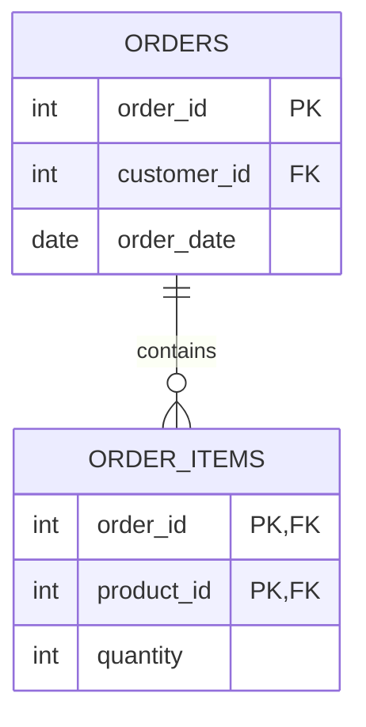

# Decomposition Algorithms

## Overview

Decomposition breaks a table into smaller tables to achieve higher normal forms. Two critical properties:
1. **Lossless join**: Original data recoverable via joins
2. **Dependency preservation**: All FDs enforceable on decomposed tables

## 3NF Synthesis Algorithm

Guarantees both lossless join and dependency preservation.

### Steps

1. **Compute minimal cover** of FDs
2. **Create relation for each FD** in minimal cover
3. **Add candidate key relation** if not already covered

### Minimal Cover Algorithm

```
Input: Set of FDs F
Output: Minimal cover Fc

1. Split right sides: A → BC becomes A → B, A → C
2. Remove redundant FDs:
   For each FD X → Y in F:
     If Y derivable from (F - {X → Y}) using X, remove it
3. Remove redundant attributes from left sides:
   For each FD XY → Z:
     If Z derivable from X using F, replace with X → Z
```

### Example: 3NF Decomposition

```
Original: Student(sid, sname, did, dname, advisor)

FDs:
- sid → sname, did, advisor
- did → dname

Minimal cover:
- sid → sname
- sid → did
- sid → advisor
- did → dname

Decomposition:
1. R1(sid, sname) from sid → sname
2. R2(sid, did) from sid → did
3. R3(sid, advisor) from sid → advisor
4. R4(did, dname) from did → dname

Optimized (combine FDs with same determinant):
- Students(sid, sname, did, advisor)
- Departments(did, dname)
```

## BCNF Decomposition Algorithm

May not preserve all dependencies, but eliminates all anomalies.

### Steps

```
Input: Relation R with FDs F

1. If R is in BCNF, done
2. Find FD X → Y that violates BCNF (X is not a superkey)
3. Decompose into:
   - R1 = X ∪ Y (with FDs: X → Y)
   - R2 = R - (Y - X) (remaining attributes)
4. Recursively decompose R1 and R2
```

### Example: BCNF Decomposition

```
Original: Enrollment(student, course, teacher)

FDs:
- {student, course} → teacher
- teacher → course

teacher → course violates BCNF (teacher is not a superkey)

Decomposition:
- TeacherCourse(teacher, course) -- from teacher → course
- StudentTeacher(student, teacher) -- remaining

Note: Original FD {student, course} → teacher is lost!
(Dependency not preserved, but data is lossless)
```

## Lossless Join Test (Chase Algorithm)

Verifies decomposition is lossless.

### Simplified Test (Binary Decomposition)

For decomposition of R into R1 and R2:
- Lossless if: R1 ∩ R2 → R1 OR R1 ∩ R2 → R2

```
Example:
R(A, B, C) decomposed into R1(A, B) and R2(B, C)
R1 ∩ R2 = {B}
If B → A or B → C exists, decomposition is lossless
```

## Foreign Key Generation

After decomposition, establish relationships:

```
For each decomposed table T with attributes from original:
  For each other table T2:
    If T2's key is subset of T's attributes:
      T.key_columns → T2 (foreign key)
```

### Example

```
Original: Orders(order_id, customer_id, customer_name, product_id, product_name)

Decomposed:
- Orders(order_id, customer_id, product_id)
- Customers(customer_id, customer_name)
- Products(product_id, product_name)

Foreign keys:
- Orders.customer_id → Customers.customer_id
- Orders.product_id → Products.product_id
```

## SQL DDL Generation

```sql
-- Template for decomposed table
CREATE TABLE {table_name} (
    {columns with types},
    PRIMARY KEY ({key_columns}),
    FOREIGN KEY ({fk_columns}) REFERENCES {parent_table}({pk_columns})
);
```

## Mermaid ERD Generation



## Handling Data During Decomposition

### Splitting Rows

```python
# Pseudocode for creating decomposed tables
def decompose(df, tables_config):
    results = {}
    for table in tables_config:
        # Select columns for this table
        cols = table['columns']
        # Remove duplicates (normalization)
        results[table['name']] = df[cols].drop_duplicates()
    return results
```

### Preserving Relationships

```python
# Ensure foreign keys are valid
def validate_fks(tables, fk_config):
    for fk in fk_config:
        child = tables[fk['child_table']]
        parent = tables[fk['parent_table']]
        # Check all FK values exist in parent
        missing = set(child[fk['column']]) - set(parent[fk['pk_column']])
        if missing:
            raise ValueError(f"Orphan FK values: {missing}")
```
